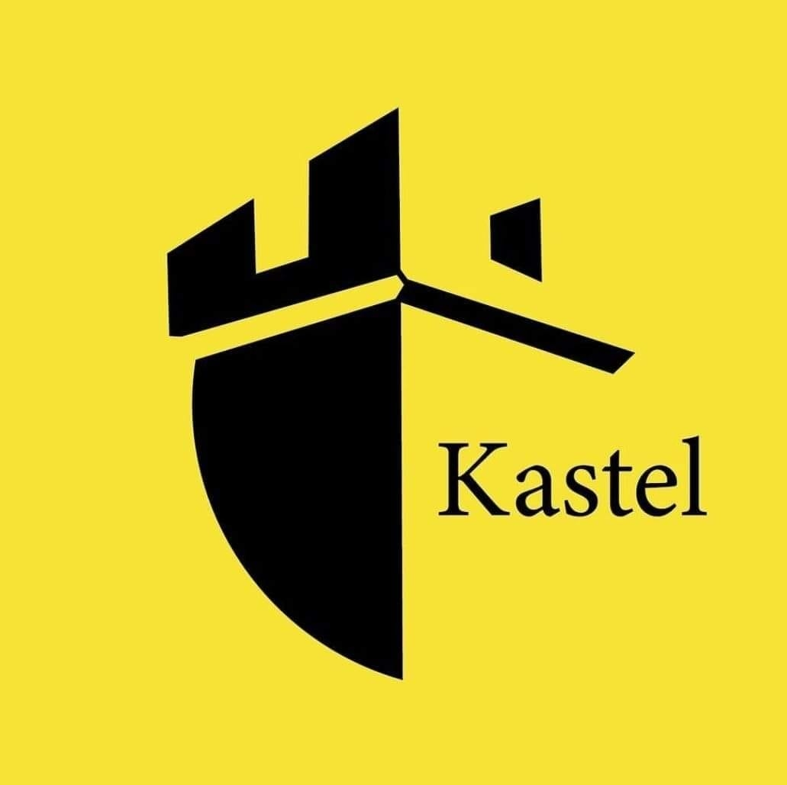

# Kastel Planner

Kastel Planner is a web application built for the Kastel NGO that aims to ease the organization of beneficiary-volunteer appointments.

## Requirements
Before you setup the application, there are a few things you need to have taken care off before you will be able to run it:

- NodeJS
- Angular CLI
- ASP .NET Core 5
- PostgreSQL

## Download and setup
Clone or download this repository by clicking the green "Code" button in this project's homepage. Please refer to the [setup guide](./documentation/development/Installation.md) for guidance while setting up the application.

## Configuration
Once you've successfully downloaded the source and finished the setup process you can move on the configuration stage. Follow the [configuration guide](./documentation/development/Configuration.md).